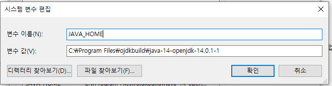
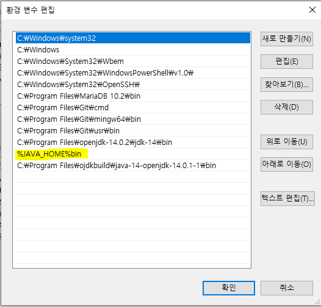

##### * NLP 하면서 다운받았던 프로그램 정리

> 경제용어단어 정리 : ekonlpy

## 1. NLTK 설치 (p15)

```python
1.
>anaconda promptd
	conda install -c anaconda nltk 
		or( conda install nltk)

2.
>spyder에서 
	import nltk
	nltk.download()
		=> book 선택 후 다운로드
		
```


## 2. okt 설치하기 위해

```
1.
open JDK 설치 (java14)
>chrom
	https://github.com/ojdkbuild/ojdkbuild > 14.0-1-1 
	> 'java-14-openjdk-14.0.1.7-1.windows.ojdkbuild.x86_64.msi` 설치

>내 컴퓨터> 환경설정> 고급> 환경변수 > 새로만들기
```




```
> path 편집
```




```2.
>cmd
	javac #설치됨을 확인
	

>anaconda promptd
	pip install JPype1
	pip install Konlpy
```


#### * colab에서 konlpy 이용방법

> !apt-get update
> !apt-get install g++ openjdk-8-jdk 
> !pip3 install konlpy


## 3. 형태소 분석기에 단어 추가 방법

```
1.
>폴더
	konlpy 폴더찾기 (anaconda / multi-python 등)
	
2. 
>폴더
	Lib\site-packages\konlpy\java

3.
aaa 폴더생성

4.
>cmd
	cd C:\Users\student\anaconda3\envs\multi_python\Lib\site-packages\konlpy\java\aaa
	
5.
aaa폴더에 open-korean-text-2.1.0 복사하여 풀기
	jar xvf ../open-korean-text-2.1.0

6. 추가할 단어 추가하기
>폴더
	C:\Users\student\anaconda3\envs\multi_python\Lib\site-packages\konlpy\java\aaa\org\openkoreantext\processor\util
	까지 와서 추가할 단어 추가하기( noun, verb, 등등 )
	
7. aaa의 'open-korean-text-2.1.0.jar' 폴더 찾아 복사 -> aaa바로 위에서 복.붙

8.
>cmd
	jar cvf open-korean-text-2.1.0.jar *

```

>okt가 아니라 Komoran 같은 다른 tag package를 사용하면 간단하게 등록할 수 있네요.
>https://datascienceschool.net/view-notebook/4bfa8007982d4c7ba35d8b42cecd38c9/
