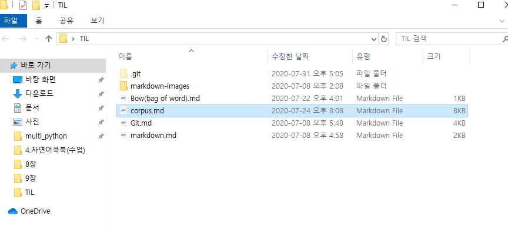

### 코퍼스

* 특정 파일의 텍스트 문서 조회

```python
from nltk.corpus import gutenberg

text = gutenberg.raw('austen-emma.txt') # 원문 텍스트 읽어오기
emma = gutenberg.words('austen-emma.txt') # word 단위로 읽어오기
	#=> ['[', 'Emma', 'by', 'Jane', 'Austen', '1816', ']', ...]
emma[0]
	#=> [
sentence = gutenberg.sents('austen-emma.txt') # 문장 단위로 읽어오기
	#=> [['[', 'Emma', 'by', 'Jane', 'Austen', '1816', ']'], ['VOLUME', 'I'], ...]
sentence[0]
	#=> ['[', 'Emma', 'by', 'Jane', 'Austen', '1816', ']']
	
tokens = nltk.word_tokenize(text) #원문 텍스트 읽어온 데이터/ 공백으로 분리한다
cat = brown.categories() #카테고리 목록 조회
news_1 = brown.raw(categories='news') # 카테고리가 뉴스인 문서 읽어오기 (품사 포함)
news_2 = brown.words(categories='news') # 단어단위로 조회, 품사제외
   
	
```

* 장르별 단어의 빈도 분포 확인

  ```python
  cfd = nltk.ConditionalFreqDist ( #장르별 단어가 몇 번 나오는지 테이블로 보여줌
   (genre, word)
   for genre in brown.categories()
   for word in brown.words (categories=genre)
    )
  print(cfd.conditions())
  ```


### WordNet

* synset : 영어단어를 유의어 집단으로 분류하여 간략하고 일반적인 정의를 제공하여 어휘목록 사이의 다양한 의미 관계를 기록한다.

* 목적

  - 사전(단어집)과 시소러스(유의어,반의어)의 배합을 만들어 직관적으로 사용 가능

  * 자동화된 본문 분석과 인공 지능 응용을 뒷받침하기 위해

#### 어휘원형
- `synsets(word)`는 word가 속한(이름이 word인 lemma를 포함하는) synset들을 리턴하고, `synset(name)`은 'name'이라는 synset을 접근하도록 하며, `lemma(word)`는 word를 이름으로 가지는 lemma들을 리턴한다.

```python
from nltk.corpus import wordnet as wn

wn.synsets('motorcar')
	#[Synset('car.n.01')]
wn.synsets('car')  
	#[Synset('car.n.01'),  #집합이 여러개인 경우
 	  Synset('car.n.02'),
 	  Synset('car.n.03'),
 	  Synset('car.n.04'),
 	  Synset('cable_car.n.01')]

for synset in wn.synsets('car'):
    print("Lemma : {}".format(synset.name())) 
    print("Definition : {}".format(synset.definition())) #동의어 집합의 의미 조회
    print("Lemma_names : {}".format(synset.lemma_names())) #어근? 원형? 	
    print("")
    
    => Lemma : car.n.01
	Definition : a motor vehicle with four wheels; usually propelled by an internal combustion engine
	Lemma_names : ['car', 'auto', 'automobile', 'machine', 'motorcar']

	Lemma : car.n.02
	Definition : a wheeled vehicle adapted to the rails of railroad
	Lemma_names : ['car', 'railcar', 'railway_car', 'railroad_car']

    Lemma : car.n.03
    Definition : the compartment that is suspended from an airship and that carries personnel and the cargo and the power plant
	Lemma_names : ['car', 'gondola']

    Lemma : car.n.04
    Definition : where passengers ride up and down
    Lemma_names : ['car', 'elevator_car']

    Lemma : cable_car.n.01
    Definition : a conveyance for passengers or freight on a cable railway
    Lemma_names : ['cable_car', 'car']

format(synset.lemmas()) #어휘의 원형
	=> [Lemma('cable_car.n.01.cable_car'), Lemma('cable_car.n.01.car')]
```


* 어휘 관계 - hyponyms(상위어),  hypernyms(하위어), part_meronyms(부분어), 

  * 나무는 뿌리의 *holonym*이고 뿌리는 나무의 *meronym*이다.

``` python
wn.synset('printer.n.03').hyponyms() #상위어
	#[Synset('addressing_machine.n.01'),
 	  Synset('character_printer.n.01'),
 	  Synset('electrostatic_printer.n.01'),
 	  Synset('impact_printer.n.01'),
 	  Synset('line_printer.n.01'),
 	  Synset('page_printer.n.01'),
 	  Synset('printer.n.02'),
 	  Synset('thermal_printer.n.01'),
	  Synset('typesetting_machine.n.01')]

wn.synset('printer.n.03').hypernyms() #하위어
	#[Synset('machine.n.01')]

wn.synset('tree.n.01').part_meronyms() #부분어
	#[Synset('burl.n.02'),
 	  Synset('crown.n.07'),
	  Synset('limb.n.02'),
 	  Synset('stump.n.01'),
 	  Synset('trunk.n.01')]

    wn.synset('tree.n.01').substance_meronyms()
	#[Synset('heartwood.n.01'), Synset('sapwood.n.01')]
    


```

[최종정리/]: https://frhyme.github.io/python-lib/nltk-wordnet/


## 품사와 품사 태깅(POS tagging)

*  품사(part-of-speech): 문장의 구성 성품 -  공통된 성질을 가진 단어끼리 모아 놓은 단어의 갈래

* 품사 태깅(part-of-speech tagging, POS tagging): 문장에 사용된 단어들에 알맞는 품사 결정

  * 분석할 문장의 올바른 품사를 결정하기 위해서는 사전에 올바른 품사가 정의된 문서 코퍼스가 있어야한다.

* 목적 - 문장의 의미(semantic)를 파악하거나, 문법(syntax)에 맞는 문장을 생성하기 위함

  ​			기계번역-> 문장의 의미를 파악한 후 다른 언어의 구조에 맞게 다른 문장을 생성할 때 필요

  ​			챗봇-> 화자가 말한 문장의 의미를 파악후, 어법에 맞는 답변 해야할 때 필요

  

``` python
import nltk

text = "And now for something completely different"
token = nltk.word_tokenize(text)
nltk.pos_tag(token)
	#[('And', 'CC'),
 	  ('now', 'RB'),
	  ('for', 'IN'),
 	  ('something', 'NN'),
 	  ('completely', 'RB'),
	  ('different', 'JJ')]
        
 

from nltk.corpus import brown

brown_news_tagged = brown.tagged_words(categories = 'news', tagset='universal') 
tag_fd = nltk.FreqDist(tag for (word, tag) in brown_news_tagged)
tag_fd.most_common() #괄호안에 5 넣으면 top5개
	#[('NOUN', 30654),
 	  ('VERB', 14399),
 	  ('ADP', 12355),
 	  ('.', 11928),
	  ('DET', 11389),
 	  ('ADJ', 6706),
 	  ('ADV', 3349),
 	  ('CONJ', 2717),
 	  ('PRON', 2535),
 	  ('PRT', 2264),
 	  ('NUM', 2166),
 	  ('X', 92)]
        


 
```


### HMM &  품사태깅

#### HMM?

* Hidden Markov Model


#### Tagged Corpus

```python
#명사 앞에 많이 쓰이는 품사 확인
word_tag_pairs = nltk.bigrams(brown_news_tagged)
noun_preceders = [(a,b) for (a,b) in word_tag_pairs]
noun_preceders = [a[1] for (a,b) in word_tag_pairs if b[1]=='NOUN']
fdist = nltk.FreqDist(noun_preceders)
fdist.most_common()[:10]
	#[('NOUN', 7959),
	  ('DET', 7373),
	  ('ADJ', 4761),
	  ('ADP', 3781),
	  ('.', 2796),
	  ('VERB', 1842),
	  ('CONJ', 938),
	  ('NUM', 894),
	  ('ADV', 186),
	  ('PRT', 94)]
  
# 뉴스에서 가장 많이 쓰이는 동사 확인
wsj = nltk.corpus.treebank.tagged_words(tagset='universal')
word_tag_fd = nltk.FreqDist(wsj)
word_tag_fd.most_common()[:10]
v = [wt[0] for (wt, _) in word_tag_fd.most_common() if wt[1]=='VERB']
print(v[:10])
	#['is', 'said', 'was', 'are', 'be', 'has', 'have', 'will', 'says', 'would']
    
# 특정 단어에 부여된 품사 빈도 확인
cfd1 = nltk.ConditionalFreqDist(wsj)
list(cfd1)[:10]
	 #['Pierre', 'Vinken', ',', '61', 'years', 'old', 'will', 'join', 'the', 'board']
    
list(cfd1.items())[:10]
	#[('Pierre', FreqDist({'NOUN': 1})),
 	  ('Vinken', FreqDist({'NOUN': 2})),
 	  (',', FreqDist({'.': 4885})),
	  ('61', FreqDist({'NUM': 5})),
	  ('years', FreqDist({'NOUN': 115})),
 	  ('old', FreqDist({'ADJ': 24})),
	  ('will', FreqDist({'VERB': 280, 'NOUN': 1})),
	  ('join', FreqDist({'VERB': 4})),
	  ('the', FreqDist({'DET': 4038, 'ADJ': 5, 'NOUN': 1, 'NUM': 1})),
	  ('board', FreqDist({'NOUN': 30}))]
 
cfd1['yield'].most_common() 
	#[('VERB', 28), ('NOUN', 20)]
 

# 과거형 동사 앞 부분 context 확인
idx1 = wsj.index(('kicked','VBD'))  #65554번째
wsj[idx1-4:idx1+1]
	#[('While', 'IN'),
	 ('program', 'NN'),
	 ('trades', 'NNS'),
	 ('swiftly', 'RB'),
	 ('kicked', 'VBD')]
```


#### N-Gram tagging

##### unigram tagger


https://zzsza.github.io/data/2018/03/10/nlp-python/ 





